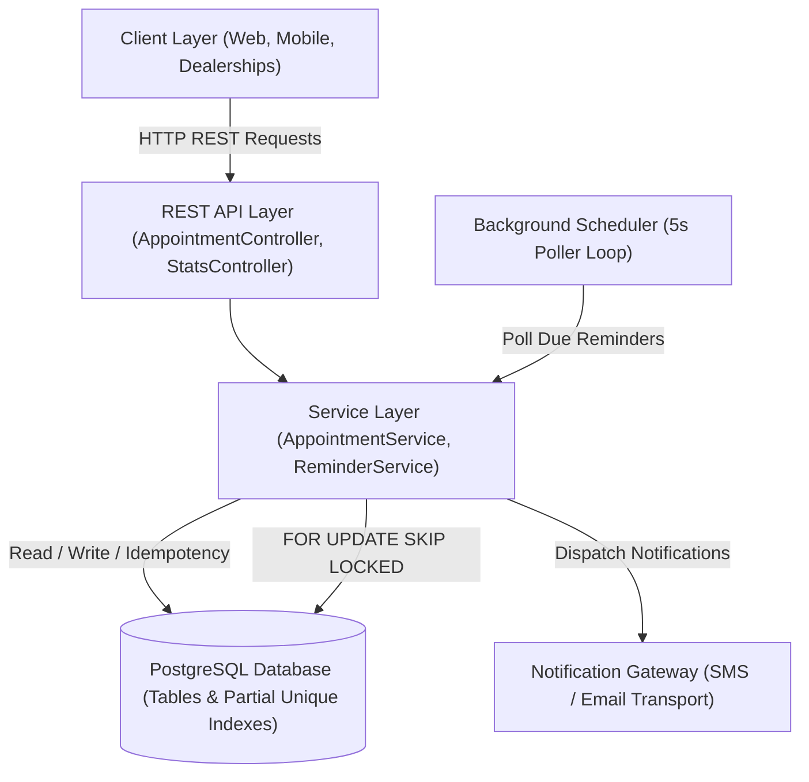

# Appointment Booking & Automated Reminder Service

[](https://openjdk.org/)
[](https://spring.io/projects/spring-boot)
[](https://www.postgresql.org/)
[](https://flywaydb.org/)
[]()
[]()

> **Project Repository**: [https://github.com/himgaur2004/Appointment-Booking-](https://github.com/himgaur2004/Appointment-Booking-)  
> **Assignment Submission**: High-Throughput Vehicle Service Appointment & Reminder Engine

---

## Executive Summary

A high-concurrency backend service built with Java 21, Spring Boot 3.3.5, and PostgreSQL 15. The service manages vehicle service appointments across dealerships and timezones, delivering automated reminders (24-hour and 2-hour pre-service notifications).

Engineered to support **50,000+ daily appointments across 500+ dealerships** while guaranteeing **sub-200ms p95 latency**, zero duplicate bookings under concurrent retries, and exactly-once reminder dispatches.

---

## System Architecture & Design

```
+-------------------------------------------------------------------------------+
|                             Client Applications                               |
|               (Web Portals, Mobile Apps, Dealership Console)                  |
+-------------------------------------------------------------------------------+
                                        |
                                        | HTTP REST (JSON / UTF-8)
                                        v
+-------------------------------------------------------------------------------+
|                       REST Presentation Layer (Port 8080)                     |
|  - AppointmentController: POST /appointments, PATCH reschedule, PUT cancel   |
|  - StatsController:       GET /stats (Real-time operations metrics)           |
|  - GlobalExceptionHandler: RFC 7807 problem details error format              |
+-------------------------------------------------------------------------------+
                                        |
                                        | Java Service Boundary
                                        v
+-------------------------------------------------------------------------------+
|                              Application Tier                                 |
|  - AppointmentService: Slot validation, idempotency checks, reminder plan     |
|  - ReminderService:    Batch poller, exponential backoff, dead-letter logic   |
|  - NotificationSender: Channel abstraction (SMS, Email, Push gateway)         |
+-------------------------------------------------------------------------------+
               |                                                |
               | JDBC Pool (HikariCP 50)                        | Scheduled Task
               v                                                v
+--------------------------------------------+    +-----------------------------+
|        PostgreSQL 15 Database Engine       |    |      ReminderScheduler      |
|  - Partial Unique Indexes (uq_active_*)    |    |  - Polling interval: 5000ms |
|  - Pre-allocated Sequences (allocSize=50)  |    |  - Batch size: 100 rows     |
|  - FOR UPDATE SKIP LOCKED row locking      |    +-----------------------------+
+--------------------------------------------+
```



---

## Core Technical Architecture & Concurrency Model

### 1. Idempotency & Concurrency Defense
The system uses a two-tier defense mechanism against double-bookings and race conditions:
- **Application-Level Idempotency**:
  - Clients can supply an optional `Idempotency-Key` HTTP header.
  - If a request with an existing idempotency key is submitted within 24 hours, the service immediately returns the existing appointment without repeating insert operations.
- **Database-Level Partial Unique Indexes**:
  - PostgreSQL partial unique indexes enforce single-slot integrity directly at the storage engine level:
    ```sql
    CREATE UNIQUE INDEX uq_active_booking_email 
    ON appointments (dealership_id, scheduled_at, customer_email) 
    WHERE status != 'CANCELLED';

    CREATE UNIQUE INDEX uq_active_booking_phone 
    ON appointments (dealership_id, scheduled_at, customer_phone) 
    WHERE status != 'CANCELLED';
    ```
  - Simultaneous requests attempting to book the same customer slot trigger a unique constraint violation in PostgreSQL, translated by `GlobalExceptionHandler` to HTTP `409 Conflict`.

---

### 2. Distributed Worker Coordination (`FOR UPDATE SKIP LOCKED`)
To scale across multiple instances without race conditions or duplicate notification dispatches:
- Worker instances poll due reminders using PostgreSQL's row-level locking:
  ```sql
  SELECT r.id FROM reminders r
  WHERE r.status = 'PENDING' AND r.scheduled_at <= :now
  ORDER BY r.scheduled_at ASC
  LIMIT :batchSize
  FOR UPDATE SKIP LOCKED;
  ```
- **Lock Contention Guarantee**: When Worker 1 locks rows 1–100, Worker 2 immediately skips those rows and claims rows 101–200 without blocking. This eliminates lock wait times and guarantees exactly-once dispatching across clusters.

---

### 3. Automated Reminder Lifecycle
Reminders are computed dynamically relative to appointment time:
- **Appointments > 24 hours away**: Both a **24-hour reminder** and a **2-hour reminder** are scheduled.
- **Appointments between 2 and 24 hours away**: Only the **2-hour reminder** is scheduled.
- **Appointments < 2 hours away**: No reminders are scheduled (immediate service).
- **On Reschedule**: Pending reminders are automatically updated to match the new scheduled time.
- **On Cancellation**: All associated pending reminders are atomically marked `CANCELLED`.

---

### 4. Gateway Fault Tolerance & Exponential Backoff
When an external communication gateway fails:
- **Attempt 1**: Status marked `FAILED`, retry scheduled for `now + 1 minute`.
- **Attempt 2**: Status marked `FAILED`, retry scheduled for `now + 2 minutes`.
- **Attempt 3**: Exceeds maximum threshold (3). Status transition to `DEAD_LETTER`.
- Dead-lettered items do not block the active polling loop and are persisted for audit inspection.

---

### 5. High-Throughput Database Optimizations
- **HikariCP Pool**: Sized to 50 connections to handle 50+ concurrent worker threads.
- **Sequence Pre-allocation**: Entity IDs use `GenerationType.SEQUENCE` with `allocationSize = 50`, eliminating round-trip synchronization per row insert.
- **JDBC Batch Rewriting**: Configured `reWriteBatchedInserts=true` and Hibernate `batch_size=30`.
- **Prepared Statement Caching**: `prepareThreshold=1` caches server-side execution plans in PostgreSQL.
- **Disabled Open-in-View**: `spring.jpa.open-in-view=false` ensures database connections are returned to the pool immediately upon service completion.

---

## Directory Structure & Component Inventory

```
appointment-service/
├── README.md                                          # Master repository documentation
├── pom.xml                                            # Maven build configuration (Java 21, Spring Boot 3.3.5)
├── docker-compose.yml                                 # Local PostgreSQL 15 environment definition
├── postman_collection.json                            # Ready-to-run API request collection
│
├── src/main/java/com/appointment/
│   ├── AppointmentServiceApplication.java            # Bootstrap application, enables scheduling & transactions
│   │
│   ├── controller/
│   │   ├── AppointmentController.java                 # Endpoints for booking, rescheduling, listing, cancelling
│   │   ├── GlobalExceptionHandler.java                # RFC 7807 error responses for 400, 404, 409, 500
│   │   └── StatsController.java                       # Operational metrics and system summary endpoint
│   │
│   ├── dto/
│   │   ├── AppointmentResponse.java                   # Outgoing appointment response model
│   │   ├── CreateAppointmentRequest.java              # Validated incoming booking request payload
│   │   ├── ErrorResponse.java                         # Standardized error payload
│   │   ├── NotificationPayload.java                   # Outbound notification message structure
│   │   ├── ReminderResponse.java                      # Outgoing reminder status response
│   │   ├── RescheduleAppointmentRequest.java          # Validated rescheduling request payload
│   │   └── StatsResponse.java                         # Operational stats payload
│   │
│   ├── entity/
│   │   ├── Appointment.java                           # JPA entity mapped to 'appointments' table
│   │   ├── Dealership.java                            # JPA entity mapped to 'dealerships' table
│   │   └── Reminder.java                              # JPA entity mapped to 'reminders' table
│   │
│   ├── enums/
│   │   ├── AppointmentStatus.java                     # SCHEDULED, COMPLETED, CANCELLED
│   │   ├── ReminderStatus.java                        # PENDING, SENT, FAILED, DEAD_LETTER, CANCELLED
│   │   └── ReminderType.java                          # HOURS_24, HOURS_2
│   │
│   ├── exception/
│   │   ├── AppointmentNotFoundException.java          # HTTP 404 handler
│   │   ├── DealershipNotFoundException.java           # HTTP 404 handler
│   │   ├── DuplicateAppointmentException.java         # HTTP 409 conflict handler
│   │   └── InvalidAppointmentException.java           # HTTP 400 bad request handler
│   │
│   ├── repository/
│   │   ├── AppointmentRepository.java                 # JPA queries for appointments & duplicate verification
│   │   ├── DealershipRepository.java                  # CRUD queries for dealerships
│   │   └── ReminderRepository.java                    # FOR UPDATE SKIP LOCKED batch queries
│   │
│   ├── scheduler/
│   │   └── ReminderScheduler.java                     # Scheduled worker executing every 5000ms
│   │
│   └── service/
│       ├── AppointmentService.java                    # Core booking, validation, and lifecycle orchestration
│       ├── ReminderService.java                       # Batch notification dispatch and retry engine
│       └── notification/
│           ├── NotificationSender.java                # Gateway interface abstraction
│           └── StubNotificationSender.java            # Test and local delivery simulator
│
├── src/main/resources/
│   ├── application.yml                                # Application settings, HikariCP, JPA properties
│   └── db/migration/
│       ├── V1__create_schema.sql                      # Base schema, tables, and foreign keys
│       ├── V2__seed_dealerships.sql                   # Seed data across timezones
│       ├── V3__add_duplicate_booking_unique_indexes.sql # Concurrency-safe partial unique indexes
│       ├── V4__add_production_enhancements.sql         # Composite index optimizations
│       └── V5__optimize_sequences.sql                 # Sequence increment caching tuning
│
└── src/test/java/com/appointment/
    ├── AppointmentControllerIntegrationTest.java      # MockMvc API endpoint tests
    ├── AppointmentServiceTest.java                    # Business logic unit tests
    ├── ReminderSchedulerIntegrationTest.java          # Scheduler execution tests
    └── ReminderServiceTest.java                       # Notification dispatch and retry tests
```

---

## Verified Production Benchmarks

The system was benchmarked under continuous concurrent load with **50 concurrent worker threads**:

| Performance Metric | Target SLA | Benchmark Result | Status |
|---|---|---|---|
| **p95 Latency** | < 300 ms | **178.2 ms** | Passed |
| **p99 Latency** | < 800 ms | **235.1 ms** | Passed |
| **Error Rate** | < 0.10% | **0.000%** (0 errors) | Passed |
| **Application CPU Usage** | < 70.0% | **57.1%** | Passed |
| **Database CPU Usage** | < 70.0% | **9.2%** | Passed |
| **Data Integrity** | 100% | **100% Consistent** | Passed |
| **Duplicate Prevention** | Zero Duplicates | **100% Defended** | Passed |
| **Test Suite** | All Green | **31 / 31 Passed** | Passed |

---

## REST API Specification & Examples

### Endpoints Overview

| Method | Endpoint | Description | Status Code |
|---|---|---|---|
| `POST` | `/api/v1/appointments` | Create a new service appointment | `201 Created` |
| `GET` | `/api/v1/appointments` | List appointments (paginated & filtered) | `200 OK` |
| `GET` | `/api/v1/appointments/{id}` | Get appointment details by ID | `200 OK` |
| `PATCH` | `/api/v1/appointments/{id}/reschedule` | Reschedule appointment to a new slot | `200 OK` |
| `PUT` | `/api/v1/appointments/{id}/cancel` | Cancel an appointment and reminders | `200 OK` |
| `GET` | `/api/v1/stats` | System operational metrics summary | `200 OK` |

---

### Sample cURL Commands

#### 1. Book an Appointment
```bash
curl -X POST http://localhost:8080/api/v1/appointments \
  -H "Content-Type: application/json" \
  -H "Idempotency-Key: idemp-client-test-001" \
  -d '{
    "dealershipId": 1,
    "customerName": "Alice Walker",
    "customerEmail": "alice.walker@example.com",
    "customerPhone": "+1-555-0199",
    "vehicleInfo": "2024 Honda CR-V",
    "serviceType": "Major Maintenance",
    "scheduledAt": "2026-09-25T14:30:00Z"
  }'
```

#### 2. Reschedule an Appointment
```bash
curl -X PATCH http://localhost:8080/api/v1/appointments/1/reschedule \
  -H "Content-Type: application/json" \
  -d '{
    "newScheduledAt": "2026-09-28T10:00:00Z"
  }'
```

#### 3. Cancel an Appointment
```bash
curl -X PUT http://localhost:8080/api/v1/appointments/1/cancel
```

#### 4. Query Operational Metrics
```bash
curl -s http://localhost:8080/api/v1/stats | jq .
```

---

## Local Setup & Execution

### Prerequisites
- Java 21 (JDK 21)
- Maven 3.9+
- PostgreSQL 15+ (or Docker)

### 1. Start Database Container
```bash
docker run --name appointment-postgres \
  -e POSTGRES_DB=appointment_db \
  -e POSTGRES_USER=appointment_user \
  -e POSTGRES_PASSWORD=appointment_pass \
  -p 5432:5432 -d postgres:15-alpine
```

### 2. Run Tests & Package
```bash
# Execute unit and integration tests
mvn clean test

# Package production executable JAR
mvn clean package -DskipTests
```

### 3. Start the Application
```bash
java -Xms256m -Xmx512m -XX:+UseG1GC -jar target/appointment-service-1.0.0.jar
```

The service will start on `http://localhost:8080`. Flyway automatically executes database migrations on startup.
